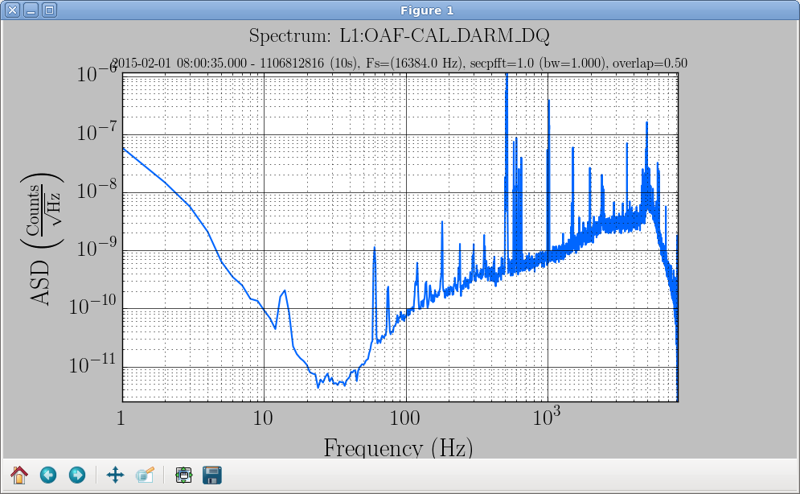

.. _interactive:

Interactive mode
***********************

All plots have the optional parameter ``--interactive`` which will display the plot and allow
limited manipulation.  It is also possible to run the command line plot from ipython and and
have full control over the matplotlib figure and axes.

For example to create a spectrum from the command line in interactive mode, one could enter:

.. code-block:: sh

    gwpy-plot spectrum --chan L1:OAF-CAL_DARM_DQ --start $(lalapps_tconvert 2/1/15 08:00) --interactive

Resulting in:

Notice the toolbar at the bottom of the image.  Besides resizing the image in the normal dragging
of the edges there are several tools that allow simple manipulation of the image:

From left to right the icons represent:

#. The Home icon returns the image to its original form.
#. The Left and Right Arrow are not applicable, they move between images and we have only one.
#. The Vertical and Horizontal overlapping arrows put the mouse in pan and zoom mode.  Holding the
   left mouse button and moving pans the image to follow the mouse.  Holding the right mouse button and
   moving zooms the image.  Up and down zooms the Y-axis in and out respectively.  Likewise moving the
   mouse right and left zooms the X-axis in and out respectively.
#. The next icon looks like a pencil drawing a rectangle (I think).  It allows you to draw a rectangle
   with the mouse and zoom in to its contents.
#. The next icon looks sort of like an image with arrows on the four sides.  This pops up a dialog
   to configure subplots.  In this case there is only one subplot and the dialog allows one to adjust
   the margins.
#. The rightmost, Floppy icon allows you to save the image.  The format is determined by the
   extension.
  * .png (Portable Network Graphics) uses lossless compression for the best representation of what's
    on the screen.
  * .jpg (Join Photographic Experts Graphics) uses a lossy compress for usually the smallest image.
  * .pdf (Portable Document Format) uses vector graphics which often looks best in documents that
    are scalable.

Using ipython for even more control
=====================================

Using ipython to run a command line plot allows one to interact with the results on the Python
level.  The only difference is to use the ``%run`` command to launch the program.  For example to
use ipython with the above example, convert the human readable date to GPS time and obtain the full
path to the plot program.  Then run the command inside ipython:

.. code-block:: sh

    $ lalapps_tconvert 2/1/15 08:00
    1106812816
    $ which gwpy-plot
    /home/joe/.local/bin/gwpy-plot
    $ ipython
    Python 2.6.6 (r266:84292, Jan 22 2014, 05:06:49)
    Type "copyright", "credits" or "license" for more information.

    IPython 0.10 -- An enhanced Interactive Python.
    ?         -> Introduction and overview of IPython's features.
    %quickref -> Quick reference.
    help      -> Python's own help system.
    object?   -> Details about 'object'. ?object also works, ?? prints more.

    In [1]: %run /home/joe/.local/bin/gwpy-plot spectrum --chan L1:OAF-CAL_DARM_DQ --start 1106812816 --interactive
    In [2]:

At this point you can enter any python statement.  The following variables are set to allow direct
manipulation of the plot:

  * timeseries[] - An array of the TimeSeries objects used to create the plot
  * plot - The matplotlib figure object
  * ax - The axis of the plot

