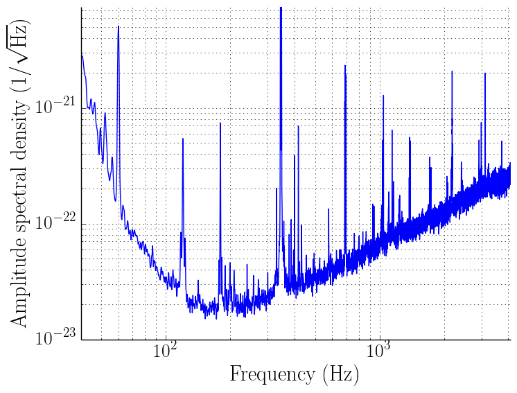
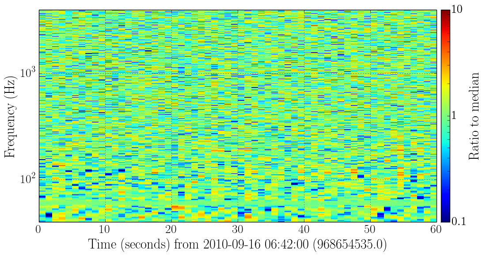

################
Welcome to GWpy!
################

GWpy is a collaboration-driven package containing a set of common tools for characterising and analysing data from current gravitational wave detectors and studying the astrophysics associated with gravitational wave emission.
The packge provides representations of all the time-domain and frequency-domain data produced by these instruments, and their analysis, with rich functionality to extract the maximum amount of information from them.

Contents
========

.. toctree::
   :maxdepth: 1

   install
   overview
   getting_started
   detector/index
   data/index
   segments/index
   plotter/index
   examples/index

Indices and tables
==================
