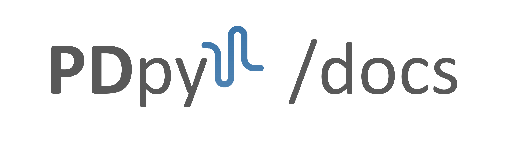

#########
|_title_|
#########

.. title:: PDpy docs

.. ifconfig:: 'dev' in release

   .. warning::

      You are viewing documentation for a development build of PDpy.
      This version may include unstable code, or breaking changes relative
      the most recent stable release.
      To view the documentation for the latest stable release of PDpy, please
      `click here <../stable/>`_.

PDpy is a collaboration-driven `Python <http://www.python.org>`_ package
providing tools for studying data from ground-based gravitational-wave
detectors.

PDpy provides a user-friendly, intuitive interface to the common time-domain
and frequency-domain data produced by the `LIGO <http://www.ligo.org>`_ and
`Virgo <http://www.ego-gw.it>`_ instruments and their analysis,
with easy-to-follow tutorials at each step.

.. image:: https://img.shields.io/conda/vn/conda-forge/pdpy
    :target: https://anaconda.org/conda-forge/pdpy/
    :alt: PDpy Conda-forge version badge
.. image:: https://img.shields.io/pypi/v/pdpy
    :target: https://pypi.org/project/pdpy/
    :alt: PDpy PyPI version badge
.. image:: https://zenodo.org/badge/9979119.svg
    :target: https://zenodo.org/badge/latestdoi/9979119
    :alt: PDpy DOI badge
.. image:: https://img.shields.io/pypi/l/pdpy.svg
    :target: https://choosealicense.com/licenses/gpl-3.0/
    :alt: PDpy license badge

***********
First steps
***********

.. toctree::
   :maxdepth: 1

   What is PDpy? <overview>
   How do I install PDpy? <install>
   Citing PDpy <citing>

*****************
Working with data
*****************

.. toctree::
   :maxdepth: 2
   :caption: Data structures

   timeseries/index
   spectrum/index
   spectrogram/index
   timeseries/statevector
   segments/index
   table/index

.. toctree::
   :maxdepth: 2
   :caption: Data manipulation

   signal/index

.. toctree::
   :maxdepth: 2
   :caption: Visualising data

   plot/index
   cli/index

.. toctree::
   :maxdepth: 1
   :caption: Other utilities

   detector/channel
   time/index
   astro/index
   env

.. toctree::
   :maxdepth: 1
   :caption: Examples

   examples/timeseries/index
   examples/signal/index
   examples/frequencyseries/index
   examples/spectrogram/index
   examples/segments/index
   examples/table/index
   examples/miscellaneous/index

.. toctree::
   :maxdepth: 1
   :caption:  Developer notes

   dev/release

******************
Indices and tables
******************

.. toctree::

* :ref:`genindex`
